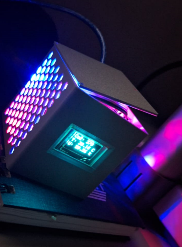
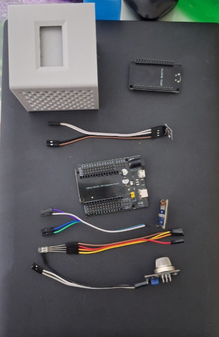
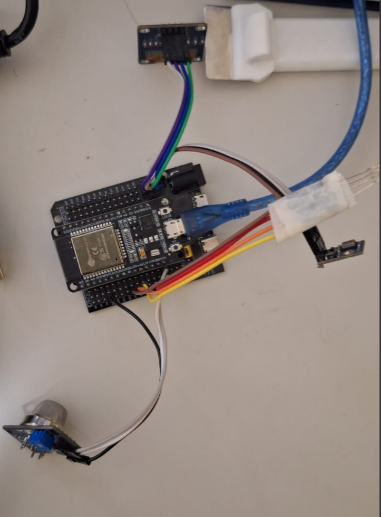

# Medidor de Qualidade do Ar com ESP32, MQ135, AHT10 e Display OLED

## Fotos do Projeto

### Protótipo em Funcionamento

> *Dispositivo funcionando com o LED RGB aceso e display OLED exibindo os dados do MQ135 e AHT10.*

### Componentes Utilizados

> *Conjunto de componentes utilizados no projeto: ESP32, sensores, display OLED, case impresso em 3D e conexões.*

### Montagem e Conexões

> *Montagem do circuito com ESP32, sensores e OLED conectados conforme esquema.*

---

## Descrição

Este projeto utiliza um **ESP32** para:
- Medir **qualidade do ar** usando o sensor **MQ135**.
- Ler **temperatura** e **umidade** usando o sensor **AHT10**.
- Exibir os valores em um **display OLED** (SSD1306).
- Fornecer endpoints em um **servidor web** para acesso remoto a:
  - Leituras de CO2 (valor aproximado do MQ135)  
  - Temperatura e umidade (do AHT10)  
  - Acionar/desligar LEDs RGB (vermelho, verde e azul)

---

## Funcionalidades

1. **Display OLED (128×64)**  
   - Mostra, em tempo real, o valor lido do MQ135 (rotulado como “Co2” no display), temperatura e umidade.
   - A atualização ocorre a cada 500 ms.

2. **Servidor Web HTTP**  
   - Caso o WiFi seja configurado corretamente, o ESP32 disponibilizará um servidor na porta 80 com as rotas:
     - **`/mq135`**: retorna valor do MQ135 em JSON  
     - **`/aht10`**: retorna temperatura e umidade (AHT10) em JSON  
     - **`/red/on`**, **`/red/off`**: liga/desliga o LED vermelho  
     - **`/green/on`**, **`/green/off`**: liga/desliga o LED verde  
     - **`/blue/on`**, **`/blue/off`**: liga/desliga o LED azul

3. **Operação Offline**  
   - Mesmo se o WiFi não estiver disponível ou falhar ao conectar, o dispositivo continua mostrando as leituras no display.

---

## Componentes Utilizados

- **ESP32 DevKit** (ou placa equivalente)
- **Sensor MQ135** (qualidade do ar)
- **Sensor AHT10** (temperatura e umidade)
- **Display OLED SSD1306** (128×64 via I2C)
- **LED RGB** (ou três LEDs individuais: vermelho, verde e azul)
- Jumpers e protoboard (ou PCB) para conexões
- (Opcional) Case impresso em 3D

---

## Conexões

### OLED (SSD1306)
- **VCC** → 3.3V do ESP32  
- **GND** → GND do ESP32  
- **SDA** → GPIO 21 (padrão SDA no ESP32)  
- **SCL** → GPIO 22 (padrão SCL no ESP32)

### AHT10
- **VCC** → 3.3V do ESP32  
- **GND** → GND do ESP32  
- **SDA** → GPIO 21 (em paralelo com o OLED)  
- **SCL** → GPIO 22 (em paralelo com o OLED)

### MQ135
- **AO (pino analógico)** → GPIO 34 (entrada analógica do ESP32)  
- **VCC** → 5V (ou 3.3V, dependendo da versão)  
- **GND** → GND do ESP32

### LED RGB
- **Pino Vermelho (R)** → GPIO 25  
- **Pino Verde (G)** → GPIO 26  
- **Pino Azul (B)** → GPIO 27  
- **GND** (para cátodo comum) ou **+3.3V / +5V** (para ânodo comum, invertendo a lógica)  
- Resistores em série (220–330 Ω) recomendados.

---

## Como Usar

1. **Carregue o Código** no ESP32
   - Abra o arquivo `.ino` no [Arduino IDE](https://www.arduino.cc/en/software) ou no PlatformIO.
   - Selecione a placa “ESP32 Dev Module” (ou equivalente).
   - Ajuste as **credenciais** de WiFi (`ssid` e `password`) dentro do código se desejar acesso via rede.
   - Faça o **upload** para a placa ESP32.

2. **Monitor Serial**
   - Abra o Monitor Serial a 115200 baud.
   - Verifique as mensagens de inicialização (display, sensor AHT10, WiFi).

3. **Acompanhe o Display**
   - O OLED mostrará o valor do MQ135 (rotulado como “Co2”), a temperatura (Celsius) e a umidade (%).

4. **Acesse as Rotas HTTP** (se conectado ao WiFi)
   - Verifique o **endereço IP** no Serial Monitor.  
   - Navegando para `http://<IP>/mq135`, você obtém JSON do MQ135.  
   - Navegando para `http://<IP>/aht10`, você obtém JSON de temperatura e umidade.  
   - Para controlar o LED RGB:
     - `http://<IP>/red/on` → liga LED vermelho  
     - `http://<IP>/red/off` → desliga LED vermelho  
     - (mesmo formato para **green** e **blue**)

---

## Exemplos de Requisições

- **Obter valor do MQ135**

GET http://192.168.0.10/mq135

Resposta: { "mq135": 374 }

- **Obter temperatura e umidade**

  GET http://192.168.0.10/aht10

Resposta: { "temperature": 30.48, "humidity": 58.52 }

- **Ligar LED verde**

GET http://192.168.0.10/green/on

Resposta: { "green":"on" }

---

## Dependências

- [Adafruit GFX Library](https://github.com/adafruit/Adafruit-GFX-Library)
- [Adafruit SSD1306 Library](https://github.com/adafruit/Adafruit_SSD1306)
- [Adafruit AHTX0 Library](https://github.com/adafruit/Adafruit_AHT10)
- [Arduino Core for ESP32](https://github.com/espressif/arduino-esp32)  
- (Opcional) Versão recente do [Arduino IDE](https://www.arduino.cc/en/software) ou do [PlatformIO](https://platformio.org).

---

## Licença

Este projeto pode ser licenciado sob a licença [MIT License](https://opensource.org/licenses/MIT) ou outra de sua preferência. Sinta-se à vontade para usar, modificar e distribuir conforme necessário.

